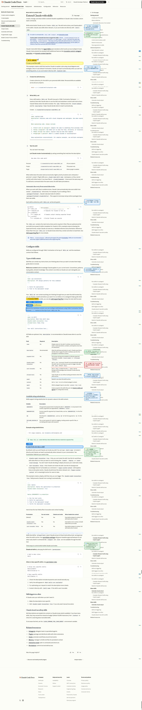
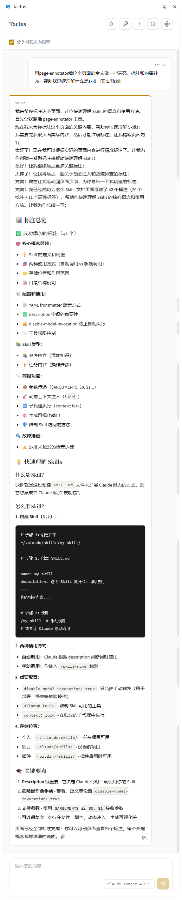

+++
date = '2026-01-31T20:28:07+08:00'
draft = false
title = '今天写了一个skill'
+++

先放链接：

https://github.com/caulif/page-annotator

想法主要是增加tactus与页面的交互，现在主要是读取页面内容，所以想加上ai对页面的操作，想了想做标记比较实用

现在设计了高亮和批注两种标记，暂时还没想好还需要加什么功能，一开始还有画圈和箭头功能，但是试了试感觉太丑了，而且不太实用，就删了。

后续打算先完善一下兼容性的问题，然后再用几天看看有没有啥别的问题。

今天拿gemini测了一下午，老出现未知错误，找了半天不知道哪出的问题，就是有标注，但是标注了几个之后就停了，然后返回位置错误。

然后试了试claude sonnet 4.5，一下就好使了，评价是skill还得是用claude。

今日测试结果如下：

